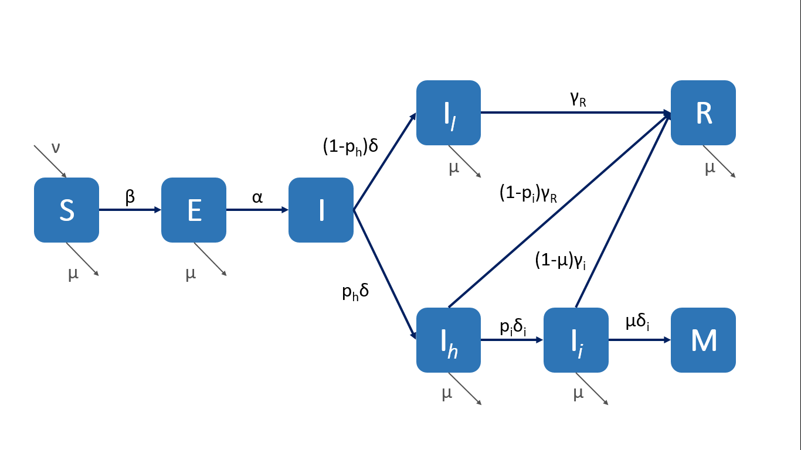

1. Hacer una gráfica apilada de casos positivos a covid por rangos de edades en adultos (18-29,30-39,40-49,50-59,60-70, 70+)

2.  Hacer una gráfica de casos totales positivos por fecha de inicio de síntomas

3. Hacer una gráfica apilada de muertes por covid por rangos de edades en adultos (18-29,30-39,40-49,50-59,60-70, 70+)

4.  Hacer una gráfica de muertes totales positivos por fecha de inicio de síntomas.

5. Hacer una gráfica apilada de hospitalizados por covid por rangos de edades en adultos (18-29,30-39,40-49,50-59,60-70, 70+)

6.  Hacer una gráfica de hospitalizados totales positivos por fecha de inicio de síntomas.

7. Infiere cuál podría ser el R_o a partir de los datos al inicio de la pandemia.

8. ¿Cuál es la probabilidad de que individuos positivos a covid sin comorbilidades sean hospitalizados por rangos de edades en adultos (18-29,30-39,40-49,50-59,60-70, 70+)? 

9. ¿Cuál es la probabilidad de que individuos positivos a covid con alguna comorbilidad sean hospitalizados por rangos de edades en adultos (18-29,30-39,40-49,50-59,60-70, 70+)? 

10. ¿Cuál es la probabilidad de que individuos positivos a covid sin comorbilidades sean intubados por rangos de edades en adultos (18-29,30-39,40-49,50-59,60-70, 70+)? 

11. ¿Cuál es la probabilidad de que individuos positivos a covid con alguna comorbilidad sean intubados por rangos de edades en adultos (18-29,30-39,40-49,50-59,60-70, 70+)? 

12. ¿Cuál es la probabilidad de que individuos positivos a covid sin comorbilidades fallezcan por rangos de edades en adultos (18-29,30-39,40-49,50-59,60-70, 70+)? 

13. ¿Cuál es la probabilidad de que individuos positivos a covid con alguna comorbilidad fallezcan por rangos de edades en adultos (18-29,30-39,40-49,50-59,60-70, 70+)? 

14. ¿Qué parámetros podrían modelar las respuestas a las preguntas 8-14 en un modelo por compartimentos?

15. Propón un modelo por compartimentos utilizando algunos de los datos, determina sus parámetros y sus ecuaciones diferenciales. Resuélvelo en R.

