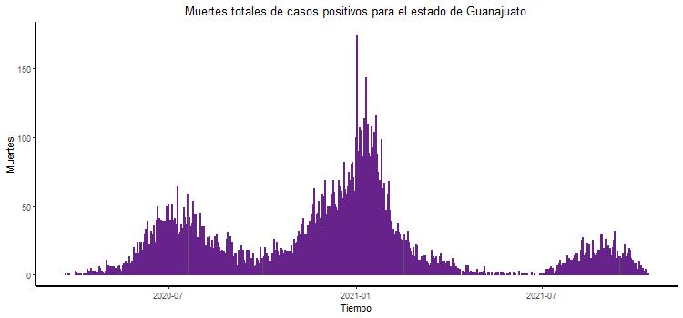
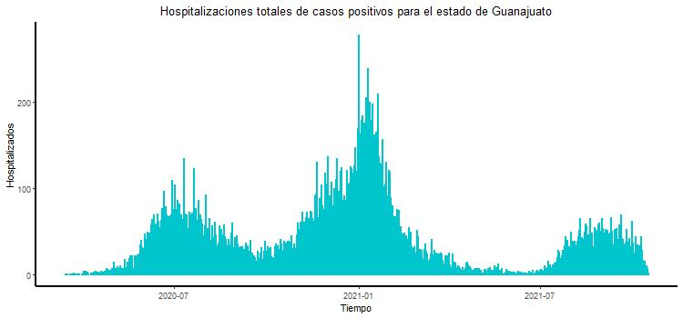
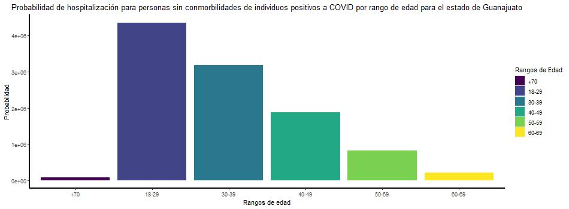

### 1. Hacer una gráfica apilada de casos positivos a covid por rangos de edades en adultos (18-29,30-39,40-49,50-59,60-70, 70+)


<p>&nbsp;</p>

### 2. Hacer una gráfica de casos totales positivos por fecha de inicio de síntomas


### 3. Hacer una gráfica apilada de muertes por covid por rangos de edades en adultos (18-29,30-39,40-49,50-59,60-70, 70+)


<p>&nbsp;</p>

### 4. Hacer una gráfica de muertes totales positivos por fecha de inicio de síntomas.


<p>&nbsp;</p>

### 5. Hacer una gráfica apilada de hospitalizados por covid por rangos de edades en adultos (18-29,30-39,40-49,50-59,60-70, 70+)


<p>&nbsp;</p>

### 6. Hacer una gráfica de hospitalizados totales positivos por fecha de inicio de síntomas.



### 7. Infiere cuál podría ser el $R_0$ a partir de los datos al inicio de la pandemia.

$$R_0 = \frac{\beta + \alpha + \delta (p_h + (1-p_h)) + p_i \delta _i }{\mu _n + \gamma _r + (1-p_i)\gamma _h + (1-\mu)\gamma _i+\mu\delta _m}$$

### 8. ¿Cuál es la probabilidad de que individuos positivos a covid sin comorbilidades sean hospitalizados por rangos de edades en adultos (18-29,30-39,40-49,50-59,60-70, 70+)? 




### 15. Propón un modelo por compartimentos utilizando algunos de los datos, determina sus parámetros y sus ecuaciones diferenciales. Resuélvelo en R.

#### Supuestos: 

- Se asumen parámetros demográficos
- La infección ocurre por interacciones con individuos infectados leves, hospitalizados e intubados
- La tasa de infección es la misma para las diferentes interacciones
- No hay heterogeneidad en los individuos suceptibles
- La muerte por enfermedad es una variable

#### Diagrama de Compartimentos


<p>&nbsp;</p>

#### Parámetros

Los parámetros de este modelo son:

- $\beta$ : tasa de infección 
- $\alpha$ : días en que los expuestos presentan síntomas
- $\delta$ : días en que un infectado se vuelve infectado leve o es hospitalizado
- $p_h$ : fracción de individuos infectados que son hospitalizados
- $(1-p_h)$ : resto de individuos infectados que no son hospitalizados, son infectados leves
- $\gamma _r$ : días de recuperación de infectados leves
- $p_i$ : fracción de individuos hospitalizados que son intubados
- $(1-p_i)$ : resto de individuos hospitalizados que no son intubados, se recuperan
- $\delta _i$ : días en que un individuo hospitalizado es intubado
- $\gamma _h$ : días en que un individuo hospitalizado se recupera
- $\mu$ : fracción de individuos intubados que mueren
- $(1- \mu )$ : resto de individuos intubados que no mueren, se recuperan
- $\gamma _i$ : días en que un individuo intubado se recupera
- $\delta _m$ : días en que un individuo intubado muere 
- $\nu$ : tasa de nacimientos
- $\mu _n$ : tasa de muerte natural
<p>&nbsp;</p>

#### Ecuaciones

Las ecuaciones de este sistema son:
$$\begin{array}{l}
\dot S = \nu - \mu _n S - \beta S (I + I_l + I_h + I_i) \\
\dot E = \beta S (I + I_l + I_h + I_i) - \alpha E - \mu _n E \\
\dot I = \alpha E - \mu _n I - p_h \delta I - (1 - p_h) \delta I \\
\dot I_l = (1 - p_h) \delta I - \mu _n I_l - \gamma _r I_l \\
\dot I_h =  p_h \delta I - p_i \delta _i I_h - (1-p_i) \gamma _h I_h - \mu _n I_h \\
\dot I_i = p_i \delta _i I_h - \mu \delta m I_i - (1- \mu ) \gamma _i I_i - \mu _n I_i \\
\dot R = \gamma _r I_l + (1-p_i) \gamma _h I_h + (1- \mu ) \gamma _i I_i - \mu _n R \\ 
\dot M = \mu \delta m I_i
\end{array}$$

#### Resolverlas numéricamente

```{r}
modelo_covid <- function (t, state, parameters){
  with(as.list(c(state, parameters)), {
    
    N <- S + E + I + Il + Ih + Ii + R + M
    dS = nu - mun*S - beta*S*(I + Il + Ih + Ii)
    dE = beta*S*(I + Il + Ih + Ii) - alpha*E - mun*E 
    dI = alpha*E - mun*I - ph*delta*I - (1-ph)*delta*I
    dIl = (1-ph)*delta*I - mun*Il - gammar*Il
    dIh = ph*delta*I - pi*deltai*Ih - (1-pi)*gammah*Ih - mun*Ih
    dIi = pi*deltai*Ih - mu*deltam*Ii - (1-mu)*gamma_i*Ii - mun*Ii 
    dR = gammar*Il + (1-pi)*gammah*Ih + (1-mu)*gamma_i*Ii - mun*R
    dM = mu*deltam*Ii
    
    list(c())
    
  })
}

parameters <- c(beta=5, alpha=2.5, delta= 3, ph=0.3, gammar=14, 
                pi=0.1, di=5, gammah=10, mu=0.4, 
                gammai=15, deltam=4, nu=4, mun=0.8)
state <- c(S= 999, E=0, I= 1, Il=0, Ih=0, Ii=1, R=0, M=0)
t <- seq(0,100,0.01)

#out <- ode(state, t, modelo_covid, parameters)

#matplot(out[,1], out[,2:4], type ="l", xlab = "tiempo", ylab = "Población", main = "Modelo HVB", lwd = 2)
#legend("topright", c("Suceptibles", "Expuestos", "Infectados", "Infectdos leve", "Infectados hospitalizados", "Infectados intbubados"), col = 1:7, lty = 1:7, cex = 0.5)
```


