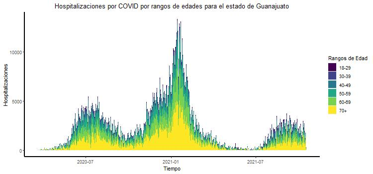

### 1. Hacer una gráfica apilada de casos positivos a covid por rangos de edades en adultos (18-29,30-39,40-49,50-59,60-70, 70+)

&nbsp;

### 2. Hacer una gráfica de casos totales positivos por fecha de inicio de síntomas

### 3. Hacer una gráfica apilada de muertes por covid por rangos de edades en adultos (18-29,30-39,40-49,50-59,60-70, 70+)

&nbsp;

### 4. Hacer una gráfica de muertes totales positivos por fecha de inicio de síntomas.

### 5. Hacer una gráfica apilada de hospitalizados por covid por rangos de edades en adultos (18-29,30-39,40-49,50-59,60-70, 70+)

&nbsp;

### 6. Hacer una gráfica de hospitalizados totales positivos por fecha de inicio de síntomas.

### 7. Infiere cuál podría ser el $R_0$ a partir de los datos al inicio de la pandemia.

### 8. ¿Cuál es la probabilidad de que individuos positivos a covid sin comorbilidades sean hospitalizados por rangos de edades en adultos (18-29,30-39,40-49,50-59,60-70, 70+)? 

### 9. ¿Cuál es la probabilidad de que individuos positivos a covid con alguna comorbilidad sean hospitalizados por rangos de edades en adultos (18-29,30-39,40-49,50-59,60-70, 70+)? 

### 10. ¿Cuál es la probabilidad de que individuos positivos a covid sin comorbilidades sean intubados por rangos de edades en adultos (18-29,30-39,40-49,50-59,60-70, 70+)? 

### 11. ¿Cuál es la probabilidad de que individuos positivos a covid con alguna comorbilidad sean intubados por rangos de edades en adultos (18-29,30-39,40-49,50-59,60-70, 70+)? 

### 12. ¿Cuál es la probabilidad de que individuos positivos a covid sin comorbilidades fallezcan por rangos de edades en adultos (18-29,30-39,40-49,50-59,60-70, 70+)? 

### 13. ¿Cuál es la probabilidad de que individuos positivos a covid con alguna comorbilidad fallezcan por rangos de edades en adultos (18-29,30-39,40-49,50-59,60-70, 70+)? 

### 14. ¿Qué parámetros podrían modelar las respuestas a las preguntas 8-14 en un modelo por compartimentos?

### 15. Propón un modelo por compartimentos utilizando algunos de los datos, determina sus parámetros y sus ecuaciones diferenciales. Resuélvelo en R.

#### Supuestos: 

- Se asumen parámetros demográficos
- La infección ocurre por interacciones con individuos infectados leves, hospitalizados e intubados
- La tasa de infección es la misma para las diferentes interacciones
- No hay heterogeneidad en los individuos suceptibles
- La muerte por enfermedad es una variable

#### Diagrama de Compartimentos

&nbsp;

#### Parámetros

Los parámetros de este modelo son:

- $\beta$ : tasa de infección 
- $\alpha$ : días en que los expuestos presentan síntomas
- $\delta$ : días en que un infectado se vuelve infectado leve o es hospitalizado
- $p_h$ : fracción de individuos infectados que son hospitalizados
- $(1-p_h)$ : resto de individuos infectados que no son hospitalizados, son infectados leves
- $\gamma _r$ : días de recuperación de infectados leves
- $p_i$ : fracción de individuos hospitalizados que son intubados
- $(1-p_i)$ : resto de individuos hospitalizados que no son intubados, se recuperan
- $\delta _i$ : días en que un individuo hospitalizado es intubado
- $\gamma _h$ : días en que un individuo hospitalizado se recupera
- $\mu$ : fracción de individuos intubados que mueren
- $(1- \mu )$ : resto de individuos intubados que no mueren, se recuperan
- $\gamma _i$ : días en que un individuo intubado se recupera
- $\delta _m$ : días en que un individuo intubado muere 
- $\nu$ : tasa de nacimientos
- $\mu _n$ : tasa de muerte natural

&nbsp;

#### Ecuaciones

Las ecuaciones de este sistema son:
$$\begin{array}{l}
\dot S = \nu - \mu _n S - \beta S (I + I_l + I_h + I_i) \\
\dot E = \beta S (I + I_l + I_h + I_i) - \alpha E - \mu _n E \\
\dot I = \alpha E - \mu _n I - p_h \delta I - (1 - p_h) \delta I \\
\dot I_l = (1 - p_h) \delta I - \mu _n I_l - \gamma _r I_l \\
\dot I_h =  p_h \delta I - p_i \delta _i I_h - (1-p_i) \gamma _h I_h - \mu _n I_h \\
\dot I_i = p_i \delta _i I_h - \mu \delta m I_i - (1- \mu ) \gamma _i I_i - \mu _n I_i \\
\dot R = \gamma _r I_l + (1-p_i) \gamma _h I_h + (1- \mu ) \gamma _i I_i \\ 
\dot M = \mu \delta m I_i
\end{array}$$

